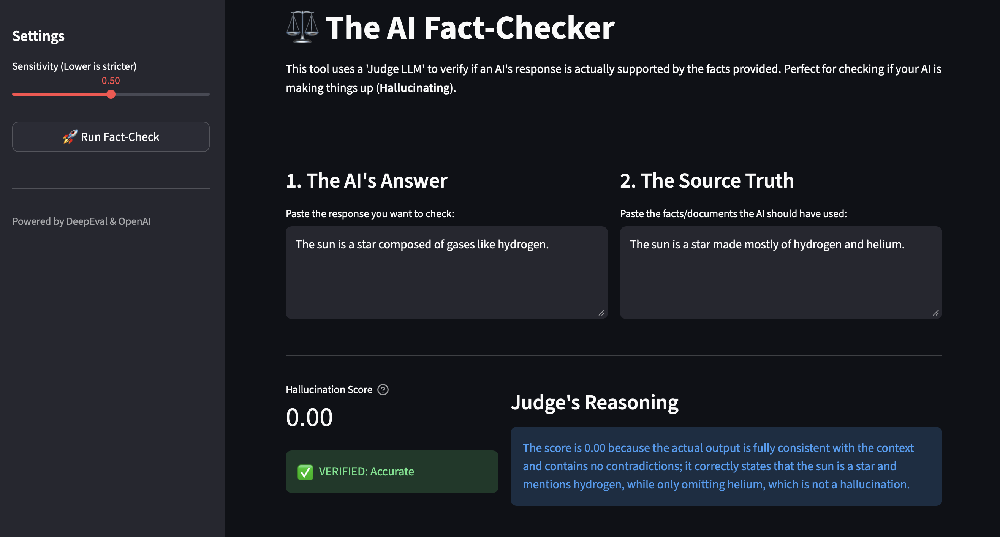

# ⚖️ Agent-Evaluator: Interactive AI Fact-Checker
An enterprise-grade evaluation suite designed to audit AI responses for Hallucinations and Factual Accuracy. This project implements the LLM-as-a-Judge pattern to provide a mathematically scored "Safety Layer" for AI-generated content.

# 🚀 The Business Problem
In high-stakes industries (Finance, Legal, Healthcare), "Hallucinations" (AI making things up) are a massive liability. Manual fact-checking is slow, inconsistent, and doesn't scale. Agent-Evaluator automates this process, acting as a digital auditor that ensures AI outputs are 100% faithful to the company’s "Source of Truth."

## ✨ Key Features
Interactive Dashboard: A Streamlit-based UI where users can paste AI responses and source documents for instant verification.

Automated Metrics: Uses DeepEval to calculate Hallucination Scores (0.0 to 1.0).

Human-Centric Design: Includes a Sensitivity Slider allowing managers to define how "strict" the judge should be based on the use case.

Explainable AI: Provides clear, plain-English reasoning for every "Pass" or "Fail" result.

## 🛠️ The Tech Stack
Core Logic: Python, DeepEval (LLM-eval framework)

Judge Model: OpenAI GPT-4o

Frontend: Streamlit

Environment: Dotenv for secure API management

## 🧪 How It Works (The 3 Scenarios)
The "Liar" Test: Catching factual contradictions (Red Status).

The "Lazy" Test: Identifying vague or unsupported answers (High Hallucination Score).

The "Verified" Test: Confirming high-fidelity, accurate responses (Green Status).

## 📥 Installation & Usage
Clone the repo: git clone https://github.com/gurusaichittoji7/Agent-Evaluator.git

Install dependencies: pip install -r requirements.txt

Set up .env: Add your OPENAI_API_KEY

Run the app: streamlit run app.py

## output

